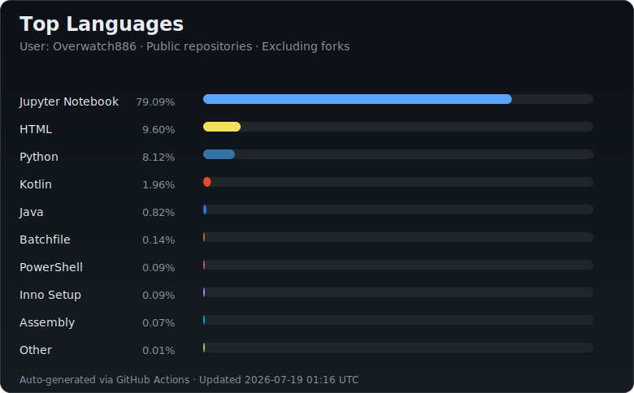

- 👋 Hi, I'm @Overwatch886
- 👀 I'm interested in ... Computer science most especially Artificial Intelligience/machine learning and quantum computing
- I aspire to be an AI/ML engineer in the future and I am open to working on related projects.
- 🌱 I'm currently learning Machine Learning Fundamentals..
- 💞️ I'm looking to collaborate on with people with any form of knowledge related to machine learning and quantum computing.
- 📫 How to reach me ...at olawuyiisrael42@gmail.com

---

## 📊 GitHub Statistics

**Profile Views & Engagement:**
- 
- 
- 

**Repository Activity:**
- 
- 

---

## 💻 Languages & Technologies

*The chart above is auto-generated weekly from GitHub API language bytes across my public repositories (forks excluded by default).*

---

## 🎯 Interests & Expertise

- 🤖 **Artificial Intelligence & Machine Learning**
- 🐍 **Python Development**
- ⚛️ **Quantum Computing**
- 🔬 **Quantum Machine Learning**
- 🧠 **AI Research**

---

<!---
Overwatch886/Overwatch886 is a ✨ special ✨ repository because its `README.md` (this file) appears on your GitHub profile.
You can click the Preview link to take a look at your changes.
--->
